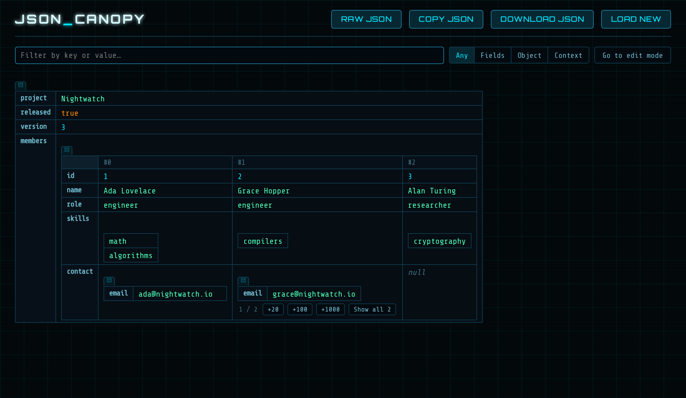
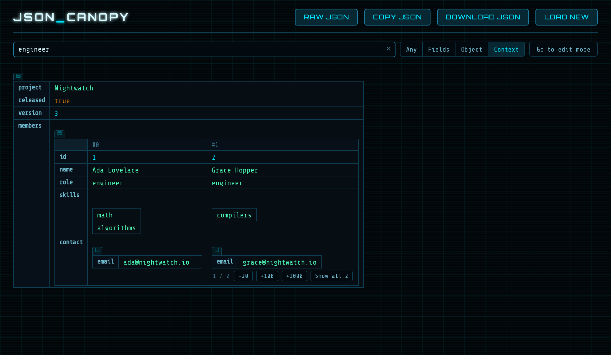
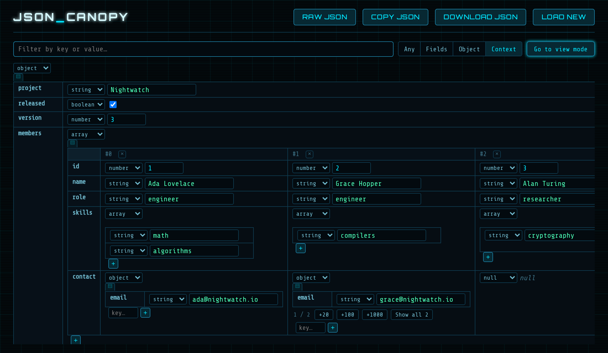

# JSON Canopy

A standalone JSON viewer and editor, permanently in Tron mode. Paste
JSON, drop a file, or browse one from disk to explore it as nested,
filterable tables — click a table to flip it between
horizontal/vertical orientation, use the field-select button to hide
columns.

Every value can be edited in place: the type dropdown next to each
value switches it between string/number/boolean/null/object/array
(retyping the value itself never changes its type), and "×"/"+"
controls add or remove object keys and array items. Use "Raw JSON" in
the titlebar to edit the whole document as text instead, and "Copy
JSON"/"Download JSON" to get the result back out.

The `app-json-explorer` component (and everything under
`src/app/json-explorer/`) started as a read-only viewer carried over
as-is from `prepare-ai-contest/frontend`, then grew editing on top —
see `docs/editor-plan.md` for the design decisions behind that.

## Screenshots

Sample document: [`samples/canopy-demo.json`](samples/canopy-demo.json).

| | |
|---|---|
|  |  |
| Nested objects and arrays render as tables inside tables; arrays of objects become one column per item. | Filtering for "engineer" in *Context* mode keeps the matching items together with their surrounding structure. |



Edit mode: a type dropdown per value, `×` / `+` to remove or add keys and items.

## Develop

```bash
npm install
npm start
```

## Build

```bash
npm run build
```

Produces a single self-contained file at
`dist/json-canopy/browser/index.html` — no other files needed, no
network access needed either: the Orbitron / Share Tech Mono webfonts
are vendored as base64 data URIs in `src/styles.css` rather than
fetched from Google Fonts at runtime.

## Publish to the Marketplace

From `intellij-plugin/`:

```bash
./gradlew verifyPlugin        # compatibility check against recommended IDEs
export CERTIFICATE_CHAIN=... PRIVATE_KEY=... PRIVATE_KEY_PASSWORD=...
./gradlew signPlugin          # optional but recommended
export PUBLISH_TOKEN=...      # token from plugins.jetbrains.com
./gradlew publishPlugin
```

The first upload must be done by hand through the Marketplace website;
`publishPlugin` works for updates after that.

## License

Licensed under the [Apache License 2.0](LICENSE). Copyright 2026
Sonensei.ch. Redistributions and derivative works, including reuse of
significant parts, must retain the copyright notice and the
[NOTICE](NOTICE) file and state any changes made.
