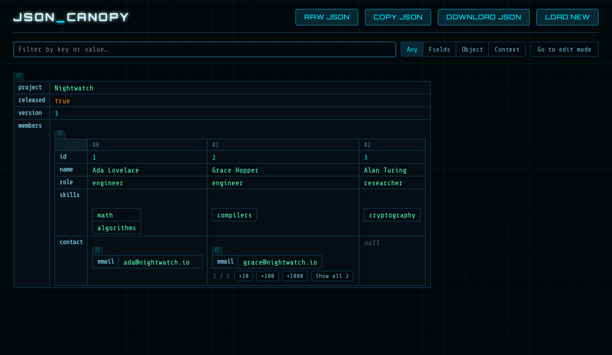
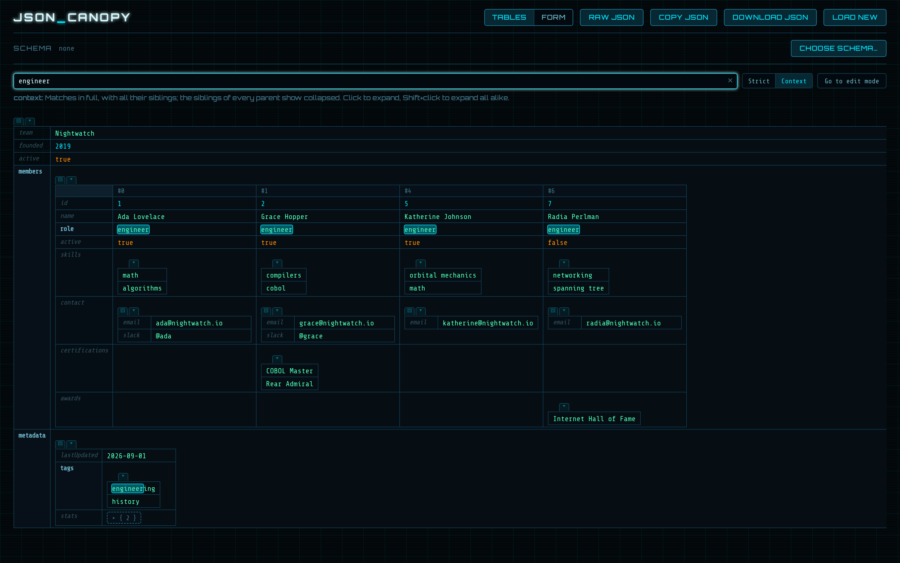
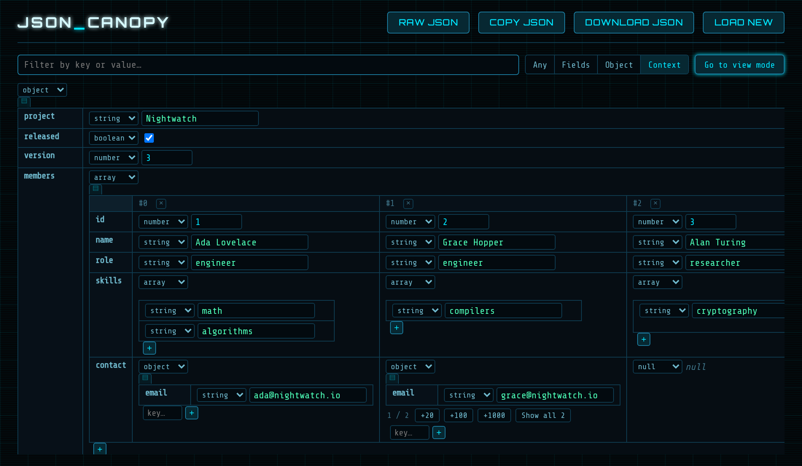

# JSON Canopy

A standalone JSON viewer and editor, permanently in Tron mode. Paste
JSON, drop a file, or browse one from disk to explore it as nested,
filterable tables — click a table to flip it between
horizontal/vertical orientation, use the field-select button to hide
columns.

Every value can be edited in place: the type dropdown next to each
value switches it between string/number/boolean/null/object/array
(retyping the value itself never changes its type), and "×"/"+"
controls add or remove object keys and array items. Use "Raw JSON" in
the titlebar to edit the whole document as text instead, and "Copy
JSON"/"Download JSON" to get the result back out.

The `app-json-explorer` component (and everything under
`src/app/json-explorer/`) started as a read-only viewer carried over
as-is from `prepare-ai-contest/frontend`, then grew editing on top —
see `docs/editor-plan.md` for the design decisions behind that.

## Features

**Explore**
- Nested objects and arrays render as tables inside tables; an array of
  objects becomes one column per item.
- Click a table to flip it between horizontal and vertical orientation.
- The field-select button (`▤`) hides columns. It closes with Esc or a
  click outside.
- Large arrays are paged; reveal more items when needed.

**Search**

One search box, three ways to look at the results:

| Mode | A matching name shows | A matching value shows | Other names |
|---|---|---|---|
| **Matches** | its value collapsed (`▸ …` / `▸ { n }`) | the value | dimmed |
| **Path** | its whole value, sub-tree included | the value | normal |
| **Context** | its whole value, plus all siblings in full | the value, plus all siblings in full | non-matching ones dimmed |

- **Names only** ignores values, so only attribute names match.
- Matches are highlighted, and a line under the search box describes the
  active mode.
- [`samples/search-demo.json`](samples/search-demo.json) with the
  walkthrough in [`samples/search-demo.md`](samples/search-demo.md)
  demonstrates every mode.

**Collapse and expand**
- Every non-empty object or array has a `▾` button to collapse it, with or
  without a search. Collapsed nodes show a chip (`▸ { 3 }`) you click to
  expand.
- Shift+click applies to all related nodes: those at the same structural
  position, such as the same column in every row of an array.

**Edit**
- Every value can be edited in place; the type dropdown switches it between
  string/number/boolean/null/object/array.
- `×` / `+` add or remove object keys and array items.
- "Raw JSON" edits the whole document as text; "Copy JSON" / "Download JSON"
  get the result back out.

**In the IDE**
- Opens `.json` files in an extra tab next to the built-in editor. Edits go
  through the IDE, so undo/redo work.
- Light and dark themes follow the IDE theme.

## Screenshots

Sample document: [`samples/canopy-demo.json`](samples/canopy-demo.json).

| | |
|---|---|
|  |  |
| Nested objects and arrays render as tables inside tables; arrays of objects become one column per item. | Searching for "engineer" in *Context* mode keeps the matching items together with their surrounding structure. |



Edit mode: a type dropdown per value, `×` / `+` to remove or add keys and items.

## Schemas

Load a JSON Schema ("Choose schema…" on the schema bar) and the editor
uses it: problems are marked on the nodes and listed in the bar (click one
to jump to it), enums become dropdowns, the type dropdown offers only what
fits, absent optional keys are offered as ghost chips and columns, and
`readOnly`, `deprecated` and the description/constraints (the `ⓘ`) are
shown. Nothing is ever blocked: the schema advises, you decide.

A **Tables | Form** toggle switches between two renderings of the same
document. The form shows objects as labelled fields in schema order, and
oneOf/anyOf with a discriminator as a variant picker that asks before it
removes anything. Documents that are essentially lists of records open as
tables, everything else as a form, until you choose; the choice is
remembered per schema. The search works in both. In the form, an
**Outline** panel navigates by structure (with problem counts) and a
**Docs** panel shows what the schema says about the field in focus.

Supported: `type`, `properties`, `required`, `enum`/`const`, `items`,
`$ref`/`$defs`, `additionalProperties`, `patternProperties`, `oneOf`,
`anyOf`, `allOf`, `default`, `readOnly`, `deprecated` and the usual
value limits. Validation (Ajv, draft-07 and 2020-12) enforces every
keyword; the UI models the ones listed. See
[`docs/schema-plan.md`](docs/schema-plan.md).

A file's `$schema` is used when it points to a file the IDE can read. In
the **IntelliJ plugin** the schema is found for you: a local `$schema`, else
whatever the IDE's JSON Schema support applies (your mappings, the
SchemaStore catalog). A remote `$schema` the IDE does not already have is
**never fetched without asking**; the schema bar offers it. In the
standalone app the same prompt fetches with the browser's `fetch`
(the server must allow CORS); a relative `$schema` cannot be resolved
there, so choose the file.

Samples with schemas are in [`samples/schemas`](samples/schemas) and
[`samples/config`](samples/config).

## Develop

```bash
npm install
npm start
npm test        # unit tests (Vitest)
```

## Build

```bash
npm run build
```

Produces a single self-contained file at
`dist/json-canopy/browser/index.html` — no other files needed, no
network access needed either: the Orbitron / Share Tech Mono webfonts
are vendored as base64 data URIs in `src/styles.css` rather than
fetched from Google Fonts at runtime.

## Publish to the Marketplace

From `intellij-plugin/`:

```bash
./gradlew verifyPlugin        # compatibility check against recommended IDEs
export CERTIFICATE_CHAIN=... PRIVATE_KEY=... PRIVATE_KEY_PASSWORD=...
./gradlew signPlugin          # optional but recommended
export PUBLISH_TOKEN=...      # token from plugins.jetbrains.com
./gradlew publishPlugin
```

The first upload must be done by hand through the Marketplace website;
`publishPlugin` works for updates after that.

## License

Licensed under the [Apache License 2.0](LICENSE). Copyright 2026
Sonensei.ch. Redistributions and derivative works, including reuse of
significant parts, must retain the copyright notice and the
[NOTICE](NOTICE) file and state any changes made.
